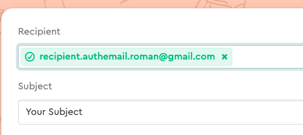
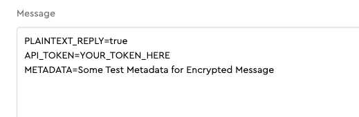
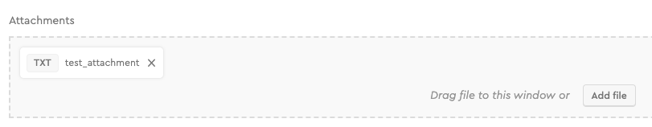
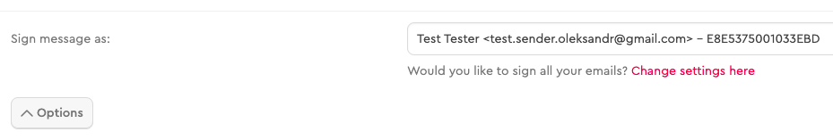

# Mail Service Usage Guide (Mailvelope tool with Gmail)

It is possible to send encrypted messages with attachments to Mail Service for further storing it in the Cardano blockchain.

**Pay attention that if you want to use [Mailvelope](https://mailvelope.com/en) with your work account,
you need to purchase a full license. Otherwise, use your personal email account.**

## Prerequisites

To save transaction (with message and attachment), you will need:

* [Google Chrome](https://www.google.com/chrome/) browser

* [Google Account](https://accounts.google.com/SignUp?hl=en)

* [Mailvelope](https://chrome.google.com/webstore/detail/mailvelope/kajibbejlbohfaggdiogboambcijhkke?hl=en) extension

* Public / private key pair, [generated in Mailvelope](https://www.mailvelope.com/en/help#configuration)

* Recipient's public key [imported to Mailvelope](https://www.mailvelope.com/en/faq#import_keys)

* Mailvelope with configured [Gmail API](https://www.mailvelope.com/en/faq#gmail_permissions) integration

* Purchased package at [PSG Self Service UI](https://psg.iog.services/)

* API Token - generated at [API Token](https://psg.iog.services/apitokens) page.

## Steps

1. Create a new user (or use with existing one) and login to [Self Service](https://psg.iog.services/)

2. Add email address and PGP public key at [PGP Public Key](https://psg.iog.services/pgppublickey) page

3. Go to mail.google.com and click the Mailvelope button - the browser should open a new Mailvelope window

4. Add the recipient - **recipient.authemail.roman@gmail.com** and fill the email subject

   


5. Prepare a message according to specific [format](#email-message-format)

   


6. Attach one or more files to message if needed

   


7. Sign message by clicking Options and choosing your user from "Sign message as:" dropdown

   


8. Sent email by clicking Submit button in the Mailvelope window

9. Wait for reply message (with link to the file on AWS S3 and link to the transaction in Cardano Explorer)

In case of success, you will get a message in reply:

``` text
Your message EMAIL_SUBJECT Thu Apr 29 11:56:34 GMT 2021 was processed successfully.

Transaction: https://explorer.cardano.org/en/transaction?id=<transactionId>

Attachments:
  http://aws_url/download/your_mail_com/96/test_attachment.txt
```

In case of failure, you will get the message in reply:

``` text
We could not process your message, subject: EMAIL_SUBJECT, sent date: Wed Apr 21 13:18:33 GMT 2021, please contact administrators.
```

## Email message format

``` text
    PLAINTEXT_REPLY=true
    API_TOKEN=your_api_token
    METADATA=Your desired information to be stored in blockchain
```

**PLAINTEXT_REPLY=true** - PSG Mail Service will send the reply in plain text

**PLAINTEXT_REPLY=false** - PSG Mail Service will send the reply encrypted by the recipient key