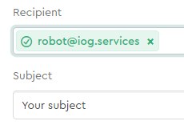
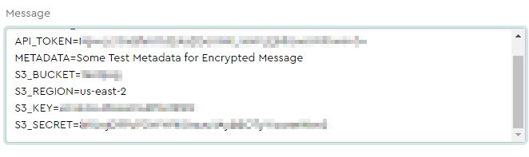
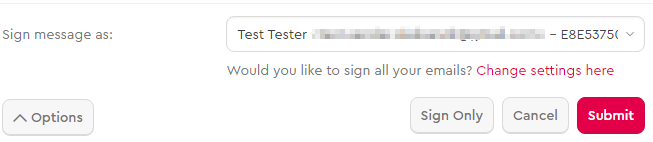

# Mail Service Usage Guide (Mailvelope tool with Gmail)

It is possible to send encrypted messages with attachments to Mail Service for further storing it in the Cardano blockchain.

**Pay attention that if you want to use [Mailvelope](https://mailvelope.com/en) with your work account,
you need to purchase a full license. Otherwise, use your personal email account.**

## Prerequisites

To save transaction (with message and attachment), you will need:

* [Google Chrome](https://www.google.com/chrome/) browser

* [Google Account](https://accounts.google.com/SignUp?hl=en)

* [Mailvelope](https://chrome.google.com/webstore/detail/mailvelope/kajibbejlbohfaggdiogboambcijhkke?hl=en) extension

* Public / private key pair, [generated in Mailvelope](https://www.mailvelope.com/en/help#configuration)

* Recipient public key [is downloaded](#how-to-get-recipient-public-key)

* Recipient's public key [imported to Mailvelope](https://www.mailvelope.com/en/faq#import_keys)

* Mailvelope with configured [Gmail API](https://www.mailvelope.com/en/faq#gmail_permissions) integration

* Purchased package at [PSG Self Service UI](https://psg.iog.services/)

* API Token - generated at [API Token](https://psg.iog.services/apitokens) page.

## Steps

1. Create a new user (or use with existing one) and login to [Self Service](https://psg.iog.services/)

2. Add email address and PGP public key at [PGP Public Key](https://psg.iog.services/pgppublickey) page

3. Go to mail.google.com and click the Mailvelope button - the browser should open a new Mailvelope window

4. Add the recipient - **[recipient](#how-to-get-recipient-public-key)** and fill the email subject

   


5. Prepare a message according to specific [format](#email-message-format)

   


6. Attach one or more files to message if needed

   


7. Sign message by clicking Options and choosing your user from "Sign message as:" dropdown

   


8. Sent email by clicking Submit button in the Mailvelope window

9. Wait for reply message (with link to the file on AWS S3 and link to the transaction in Cardano Explorer)

In case of success, you will get a message in reply:

``` text
Your message EMAIL_SUBJECT Thu Apr 29 11:56:34 GMT 2021 was processed successfully.

Transaction: https://explorer.cardano.org/en/transaction?id=<transactionId>

Attachments:
  http://aws_url/download/your_mail_com/96/test_attachment.txt
```

In case of failure, you will get the message in reply:

``` text
We could not process your message, subject: EMAIL_SUBJECT, sent date: Wed Apr 21 13:18:33 GMT 2021, please contact administrators.
```

11. [Download file](#how-to-download-file-from-s3-bucket) from AWS S3 bucket if needed  

## Email message format

``` text
API_TOKEN=your_api_token
METADATA=Some Test Metadata for Encrypted Message
S3_BUCKET=your_bucket_name
S3_REGION=your_bucket_region
S3_KEY=aws_user_access_key
S3_SECRET=aws_user_secret_key
PLAINTEXT_REPLY=true
BASE_URL=optional_custom_download_url
```

**API_TOKEN** - User token, generated at [PSG Self Serve UI](https://psg.iog.services/apitokens)

**METADATA** - User message to be included in the transaction metadata (Optional).  

Newline characters are not supported.

Use multiple METADATA fields in one message to conveniently add multiple lines of metadata

**S3_BUCKET** - AWS S3 bucket name

**S3_REGION** - AWS S3 region name for bucket

**S3_KEY** - AWS IAM user access key

**S3_SECRET** - AWS IAM user secret key

**BASE_URL** - Custom URL prefix for files saved on AWS S3 (Optional)

**PLAINTEXT_REPLY** - If set to true - response email will not be encrypted by the recipient key.
Configured to **false** by default or if parameter is not specified. (Optional)

### How to get recipient public key
**Recipient addresses:**

* robot-testnet@iog.services (for [PSG Testnet Self Serve UI](https://psg-testnet.iog.services/))
* robot@iog.services (for [PSG Mainnet Self Serve UI](https://psg.iog.services/))

Find public key by email using one of the following PGP Key Servers:

* [keys.openpgp.org](https://keys.openpgp.org/)
* [Mailvelope Key Server](https://keys.mailvelope.com/)  

### How to download file from S3 bucket

- If you configured [public access for all](create_minimal_s3_user.md) - you can download the file by executing GET request URL from Mail Service response
  (e.g.from browser)
- If you set restricted access, you need to include custom headers to download request:
```
curl -i -H "aws_key: your_key" -H "aws_secret: your_secret" -H "aws_region: bucket_region"  https://psg.iog.services:2001/download/bucketname/path-to-file
```