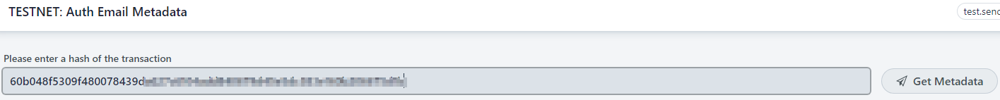

# Verify transaction metadata

PSG Self Service UI offers an option to get information about transaction, saved at the Cardano blockchain: metadata message, attachments list.

Additionally, it is possible to verify file signatures.

## Prerequisites

To perform metadata verification for transaction, you will need:

* [gpg](https://gpgtools.org/) command line tool

* User account at PSG Self Service UI

* Transaction successfully saved in Cardano blockchain

## How to verify transaction metadata

1. Login to [PSG Self Service UI](https://test.iog.services/)

2. Navigate to the [Auth Email Metadata](https://test.iog.services/authemailmetadata) page

3. Enter the hash of transaction that has been already processed 
   by the Mail Service and click "Get Metadata" button  

    

4. As a result you should get the list of one or more attachments saved with the transaction as 
   well as custom metadata specified in the email body

   

5. If you want to verify file signature - click "Download signature" button

6. Verify file signature with [gpg tool from the command line](#how_to_verify_file_with_signature)

### How to verify file with signature

``` bash
gpg --verify downloaded_signature signed_file
```
