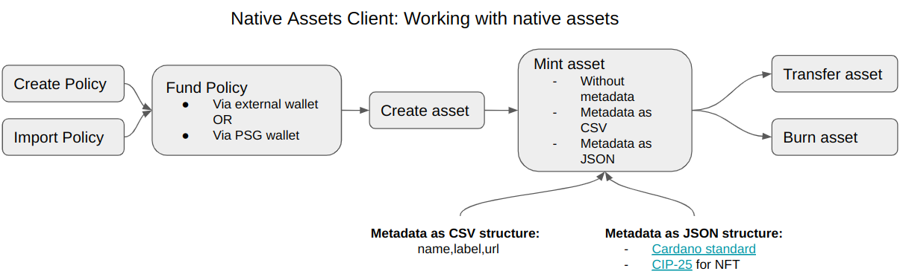
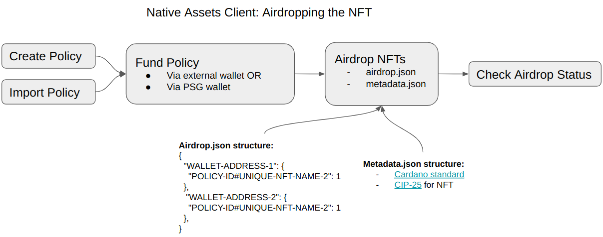

# Native Assets Client - User Guide

This document describes usage of Native Assets Client.  

You can read more about native assets in the [Cardano documentation](https://docs.cardano.org/native-tokens/learn).

Native Assets Client wraps the work of **minting**, **transferring**, and **burning** native assets 
on the Cardano blockchain in the form of a java command-line tool.

## Installation:
- Download the latest version from the [repository](https://psg-releases.s3.us-east-2.amazonaws.com/native-assets-client-0.3.12.zip)
- Unzip it into a folder
- Set `clientId` and`apiKey` at `/bin/conf/application.conf` to the ones from Self Serve UI
- Set `host`, `port` for testnet or mainnet environments
- Make native asset client executable
```bash
sudo chmod +x /bin/native-assets-client
```
- Run client from the command line
```bash
./bin/native-assets-client -COMMAND
```
where COMMAND - one of the supported ones

## Supported commands
- `createPolicy` - Creates the policy context for minting, burning etc
- `getPolicy` - Gets the policy by id
- `listPolicies` - Lists the existing policies contexts
- `deletePolicy` - Deletes the policy context
- `createAsset` - Creates native asset for minting, burning etc.
- `getAsset` - Gets the asset by policyId and name
- `listAssets` - Lists the existing native asset contexts
- `deletePolicy` - Deletes the native asset context
- `mint` - Mints specific amount of new native assets
- `transfer` - Transfers new native assets to an address
- `burn` - Burns specific amount of native assets
- `importPolicy` - Import and stores the keys and the policy on the server side
- `airdrop` - Submits the airdrop of multiple NFTs with same policyId for minting
- `airdropStatus` - Checks the status of previously submitted airdrop

## Flows

  




**NOTE:** Please make sure that you have at least **1.5 ADA** per address before submitting an airdrop.
**NOTE:** You can specify more than one native assets during an airdrop.

## Native Asset Client - API

### Create new policy
```bash
./bin/native-assets-client -createPolicy -name DocPolicy
```

### Check list of policies
```bash
./bin/native-assets-client -listPolicies
```

### Get policy
```bash
./bin/native-assets-client -getPolicy -policyId
```

### Delete policy
```bash
./bin/native-assets-client -deletePolicy -policyId
```

### Import policy
```bash
./bin/native-assets-client -importPolicy -name ImportedPolicy -policyJson policy.json -policySigningKey policy.skey -policyVerKeyFile policy.vkey
```

### Create new asset
```bash
./bin/native-assets-client -createAsset -assetName DocAsset
```

### Check list of assets
```bash
./bin/native-assets-client -listAssets
```

### Get asset
```bash
./bin/native-assets-client -getAsset -policyId
```

### Delete asset
```bash
./bin/native-assets-client -deletePolicy -policyId
```

### Mint native assets
```bash
# Mint native assets
./bin/native-assets-client -mint -amount 10 -policyId 2f91e6 -assetName DocAsset
# Mint native assets with metadata as CSV
./bin/native-assets-client -mint -amount 10 -policyId 2f91e6 -assetName DocAsset -metadata metadata.csv
# Mint native assets with metadata as JSON
./bin/native-assets-client -mint -amount 10 -policyId 2f91e6 -assetName DocAsset -arbitraryMetadata metadata.json
```

### Transfer assets to an address
```bash
./bin/native-assets-client -transfer -policyId 2f91e6 -amount 10 -address addr_test1vzpvvs
```

### Burn native assets
```bash
./bin/native-assets-client -burn -amount 10 -policyId 2f91e6
```

### Submit airdrop with multiple NFTs
```bash
./bin/native-assets-client -airdrop -airdropFile airdrop.json -arbitraryMetadata metadata.json
```

### Check the airdrop status
```bash
./bin/native-assets-client -airdropStatus -batchId alskd-skdf
```

### Show help for command
```bash
# Help message for particular command
./bin/native-assets-client -- -help -COMMAND
# Full help message - list of supported commands
./bin/native-assets-client -- -help -all
```


