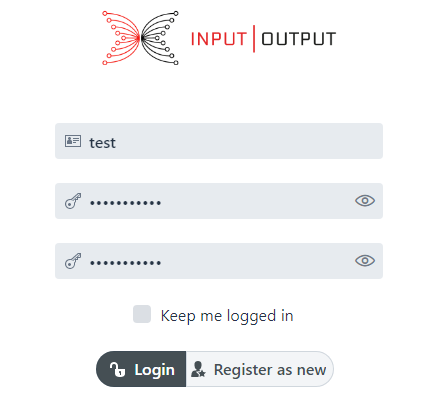
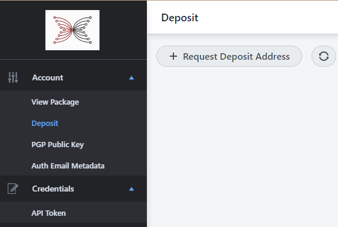
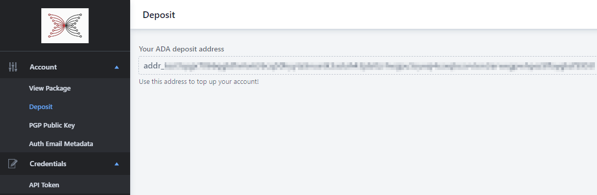
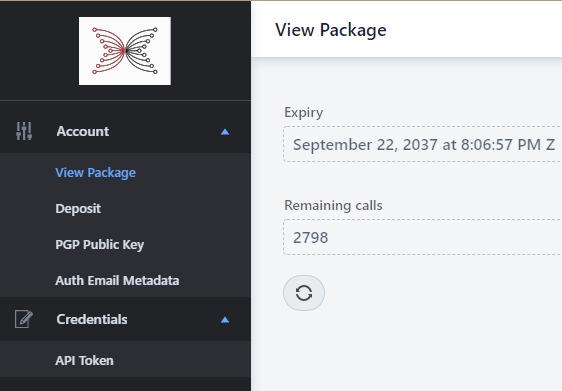
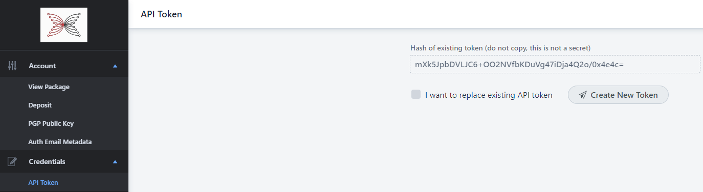
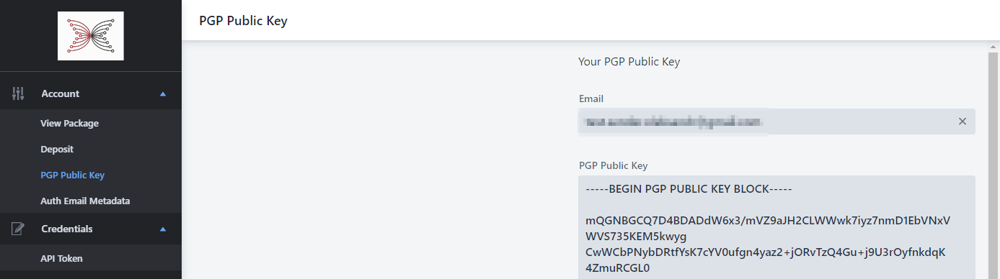

# PSG Services - New User guide

### As a new user, you need to perform the following steps to start working with PSG Services:

1. Open [PSG Services Login](https://prod.iog.services/) page
2. Enter username, password and select the "Register as new user" button
3. Re-enter password in the confirmation field and click the "Register as new user" button again  
   
     
   

4. You will be navigated to the View Package page by default
5. Go to the Deposit page by clicking a link in the left menu bar
     
   

6. Select "Request Deposit Address". Wait up to one minute and update the page content by clicking the refresh button on the page.  
   You should get a generated wallet address for funding on the page.  
   
   
   
7. Purchase PSG Services [package](#psg-services-package-description).
   
   You can navigate to the View Package page from the menu bar on the left side to check the package status.  
   
   

8. Generate a new token at the [API Token](https://prod.iog.services/apitokens) page. Do not forget to save the token value, as it will not be displayed on the page after the page refreshes.  
   You can always replace an existing token with a new one by selecting the "I want to replace existing API Token" option.
     
   

9. Set your email and PGP public key at the [PGP Public Key](https://prod.iog.services/pgppublickey) page.
   

10. **Now, you are ready to use PSG Services!**

### PSG Services package description:
The package operates by allowing a certain maximum number of calls which expire after a certain time.  

So for example for 5 ADA you might get 20 calls, expiring after 30 days.  
- If you use up all calls within the time allowed you will need to purchase more 
- If the allowed time expires then any remaining calls are lost
- If you purchase a second 'package' before the first has expired then any surplus calls are added to the new amount

E.g., if you have 3 calls that expire on May 1, then after depositing 5 ADA you will have 23 calls that will expire on May 31.

